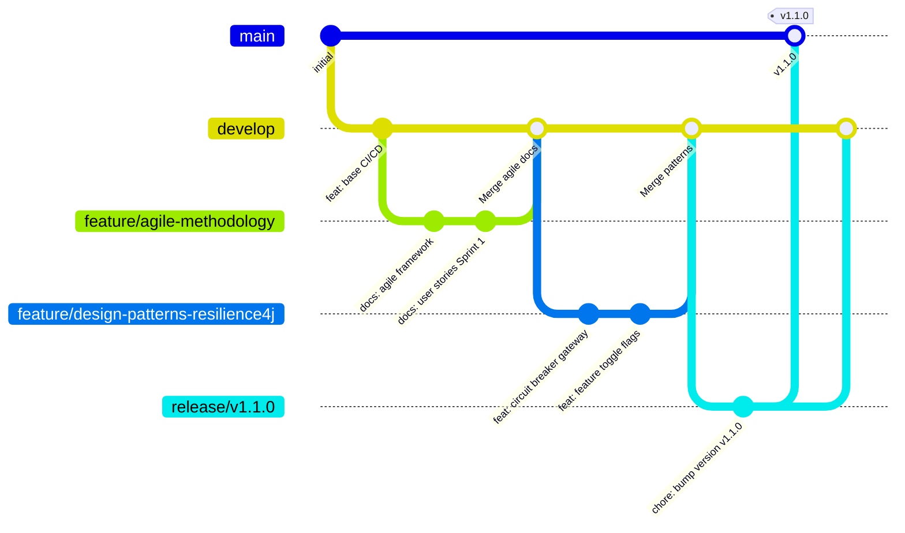

# Estrategia de Branching — CircleGuard

## Modelo: GitFlow

CircleGuard adopta **GitFlow** como estrategia de branching. Este modelo es adecuado para un sistema de microservicios con múltiples ambientes (dev / stage / prod) y ciclos de release controlados.

---

## Estructura de Ramas



---

## Tipos de Ramas

| Rama | Origen | Destino | Propósito |
|------|--------|---------|-----------|
| `main` | — | — | Código en producción. Solo recibe merges desde `release/*` o `hotfix/*`. Siempre deployable. |
| `develop` | `main` | — | Rama de integración continua. Las features se integran aquí primero. |
| `feature/*` | `develop` | `develop` | Desarrollo de nuevas funcionalidades. Nombre: `feature/<descripcion-corta>`. |
| `release/*` | `develop` | `main` + `develop` | Preparación de un release: bumping de versión, ajustes finales. Nombre: `release/vX.Y.Z`. |
| `hotfix/*` | `main` | `main` + `develop` | Correcciones urgentes en producción. Nombre: `hotfix/<descripcion>`. |

---

## Convenciones de Commits

Se usa **Conventional Commits** para habilitar la generación automática de Release Notes y versionado semántico:

```
<type>(<scope>): <descripcion corta>

[body opcional]

[footer opcional: BREAKING CHANGE, closes #issue]
```

| Tipo | Significado | Efecto en versión |
|------|-------------|-------------------|
| `feat` | Nueva funcionalidad | MINOR (1.X.0) |
| `fix` | Corrección de bug | PATCH (1.0.X) |
| `docs` | Solo documentación | PATCH |
| `refactor` | Refactorización sin cambio funcional | PATCH |
| `test` | Añadir o corregir tests | PATCH |
| `chore` | Tareas de mantenimiento (build, deps) | PATCH |
| `BREAKING CHANGE` (footer) | Cambio incompatible con versión anterior | MAJOR (X.0.0) |

---

## Reglas de Protección

- `main`: protegida — requiere PR + review aprobado + pipeline verde antes de merge.
- `develop`: protegida — requiere PR + pipeline verde.
- `feature/*`: libre para el desarrollador, se elimina tras el merge.

---

## Flujo Típico de una Feature

```bash
# 1. Partir siempre desde develop actualizado
git checkout develop && git pull origin develop

# 2. Crear rama de feature
git checkout -b feature/mi-feature

# 3. Desarrollar con commits convencionales
git commit -m "feat(auth): add JWT refresh token endpoint"

# 4. Abrir PR hacia develop en GitHub
# 5. Code review + pipeline verde → merge
# 6. Borrar la rama feature tras el merge
```

---

## Flujo de Release

```bash
# 1. Crear rama release desde develop
git checkout develop && git checkout -b release/v1.2.0

# 2. Ajustar versión, generar release notes
pwsh ci/scripts/generate-release-notes.ps1 -Service "circleguard" -BuildNumber "42"

# 3. PR a main → merge → tag automático
# 4. Back-merge a develop para sincronizar
```

---

## Evidencia de Implementación

Las siguientes ramas fueron creadas como parte de este proyecto:

| Rama | Estado | PR |
|------|--------|----|
| `develop` | ✅ Activa | — |
| `feature/agile-methodology` | ✅ Mergeada a develop | PR #1 |
| `feature/design-patterns-resilience4j` | ✅ Mergeada a develop | PR #2 |
