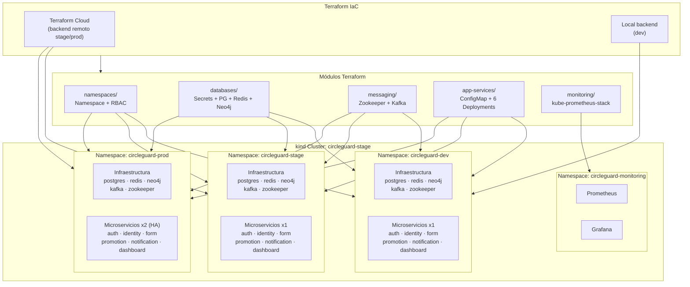

# Arquitectura de Infraestructura — CircleGuard IaC con Terraform

## Resumen

La infraestructura de CircleGuard está gestionada como código (IaC) con **Terraform**, usando una arquitectura modular multi-ambiente que permite reproducir el entorno completo de forma declarativa.

| Característica | Valor |
|----------------|-------|
| Herramienta IaC | Terraform 1.14.x |
| Providers | `hashicorp/kubernetes ~> 2.31`, `hashicorp/helm ~> 2.14` |
| Cluster | kind (Kubernetes in Docker) — `circleguard-stage` |
| Namespaces | `circleguard-dev`, `circleguard-stage`, `circleguard-prod` |
| Backend dev | Local (`terraform.tfstate`) |
| Backend stage/prod | Terraform Cloud (organización: `circleguard`) |
| Módulos | 5 módulos reutilizables |

---

## Estructura de módulos

```
terraform/
├── modules/
│   ├── namespaces/        # Namespace + RBAC (ServiceAccount, Role, RoleBinding)
│   ├── databases/         # Secrets + PostgreSQL + Redis + Neo4j
│   ├── messaging/         # Zookeeper + Kafka
│   ├── app-services/      # ConfigMap + 6 microservicios (for_each)
│   └── monitoring/        # Prometheus + Grafana (kube-prometheus-stack via Helm)
└── environments/
    ├── dev/               # Réplicas=1, image_tag=dev-latest,  backend=local
    ├── stage/             # Réplicas=1, image_tag=stage-latest, backend=TF Cloud
    └── prod/              # Réplicas=2, image_tag=prod-latest,  backend=TF Cloud
```

---

## Diagrama de arquitectura



---

## Diferencias por ambiente

| Aspecto | dev | stage | prod |
|---------|-----|-------|------|
| Réplicas por servicio | 1 | 1 | **2 (HA)** |
| Image tag | `dev-latest` | `stage-latest` | `prod-latest` |
| Backend Terraform | local | Terraform Cloud | Terraform Cloud |
| Monitoreo | ✗ (desactivado) | ✓ Prometheus + Grafana | ✓ Prometheus + Grafana |
| Alertmanager | ✗ | ✗ | ✓ |
| Prometheus retention | — | 7d | **30d** |
| Feature flags (strict QR) | `false` | `true` | `true` |
| Feature flags (email notify) | `false` | `true` | `true` |

---

## RBAC por namespace

Cada namespace recibe automáticamente (módulo `namespaces/`):

```
ServiceAccount: circleguard-sa
    ↓
RoleBinding: circleguard-role-binding
    ↓
Role: circleguard-role
    - pods, services, configmaps → get/list/watch
    - deployments, replicasets   → get/list/watch
```

Este principio de mínimo privilegio asegura que los pods no puedan modificar su propio namespace ni acceder a otros.

---

## Gestión de secretos

Los secretos se crean en Kubernetes vía el módulo `databases/`:

| Secret | Claves |
|--------|--------|
| `circleguard-db-secret` | `postgres-user`, `postgres-password`, `neo4j-password` |
| `circleguard-app-secret` | `jwt-secret`, `vault-hash-salt` |

- **Dev:** valores en `terraform.tfvars` (aceptable para desarrollo local)
- **Stage/Prod:** valores inyectados como variables **sensitivas y enmascaradas** en el workspace de Terraform Cloud — nunca en el repositorio

---

## Feature Toggles via ConfigMap (Terraform)

El módulo `app-services/` genera el ConfigMap `circleguard-config` con los toggles ajustados por ambiente:

```hcl
# En main.tf del módulo app-services:
CIRCLEGUARD_FEATURES_STRICT_QR_VALIDATION = var.environment == "dev" ? "false" : "true"
```

Esto permite cambiar una feature sin redespliegue — solo `terraform apply` actualiza el ConfigMap.

---

## Comandos de operación

### Prerequisitos

```bash
# 1. Instalar kind
kind create cluster --name circleguard-dev

# 2. Verificar contexto
kubectl config use-context kind-circleguard-dev
```

### Dev (backend local)

```bash
cd terraform/environments/dev

terraform init
terraform plan -var-file="terraform.tfvars"
terraform apply -var-file="terraform.tfvars"
terraform destroy -var-file="terraform.tfvars"
```

### Stage / Prod (Terraform Cloud)

```bash
cd terraform/environments/stage   # o prod

# Primera vez: autenticarse
terraform login

terraform init
terraform plan   # variables sensitivas desde TF Cloud workspace
terraform apply  # requiere aprobación en TF Cloud (si está configurado)
```

---

## Costos de infraestructura estimados

| Componente | Dev (local) | Stage (kind/local) | Prod (cloud equiv.) |
|------------|-------------|-------------------|---------------------|
| Kubernetes cluster | kind (gratis) | kind (gratis) | EKS $0.10/h ≈ $73/mes |
| PostgreSQL | local | local | RDS t3.micro ≈ $15/mes |
| Redis | local | local | ElastiCache t3.micro ≈ $12/mes |
| Neo4j | local | local | Neo4j AuraDB Free / $65/mes |
| Kafka | local | local | MSK t3.small ≈ $44/mes |
| Monitoring | — | Prometheus/Grafana | CloudWatch ≈ $20/mes |
| **Total estimado** | **$0** | **$0** | **~$230/mes** |

> Los ambientes dev y stage corren en kind sobre Docker Desktop — costo $0. La columna "Prod (cloud equiv.)" muestra el costo equivalente si se migrara a AWS.
